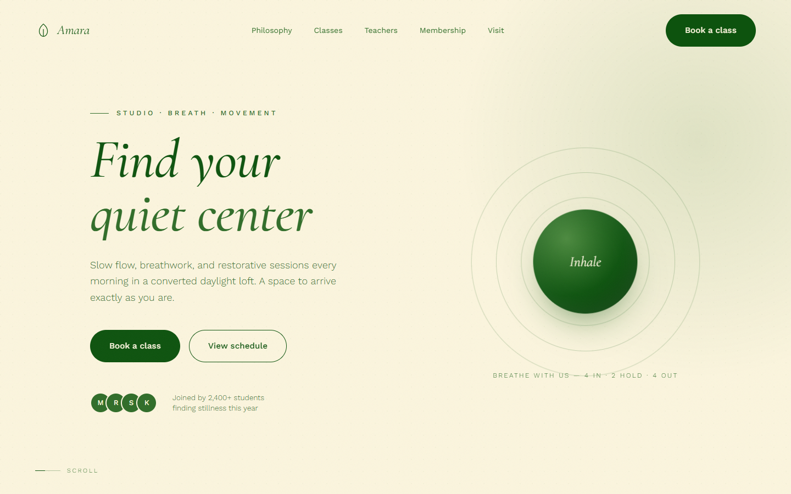

<p align="center">
  
</p>

# Amara Yoga Studio

A single-page marketing site for a boutique yoga studio — slow flow, breathwork, and
restorative practice. Hand-built with plain HTML, CSS, and vanilla JavaScript. No build
step, no framework, no dependencies.

**Live:** https://amara-yoga-studio.vercel.app

## Stack

| | |
|---|---|
| Markup | Static `index.html` |
| Styles | `styles.css` — CSS custom properties, `clamp()` type scale, container queries via media queries |
| Behaviour | `script.js` — one IIFE, no libraries |
| Fonts | Cormorant Garamond + Work Sans, self-hosted as latin `woff2` in `fonts/` (no third-party requests) |
| Hosting | Vercel (static, zero-config) |

## Interaction design

Everything below degrades gracefully and is gated on `prefers-reduced-motion` and
pointer type:

- **Intro loader** with a counter, then a masked line-reveal on the hero headline
- **Custom cursor** with grow / drag states + **magnetic** buttons (fine pointer only)
- **Inertia scroll** — wheel-driven lerp on the real window scroll position
- **Horizontal pinned gallery** for the class list (falls back to a stacked grid ≤ 820px or with reduced motion)
- **Parallax** on the hero orb, glow, and philosophy image (transform-only, rAF-throttled)
- **Scroll progress** bar, **hide-on-scroll** nav, scroll-spy active links
- **Cursor spotlight** on the dark testimonial section
- Per-class **line-art icons** that invert on hover
- Running **marquee**, animated grain overlay, outlined footer wordmark

## Local development

No tooling required — open `index.html`, or serve the folder:

```bash
npx serve .
```

## Deploying to Vercel

The repo is zero-config. Import it in the Vercel dashboard (Framework Preset: **Other**,
build command: none, output directory: `./`). `vercel.json` adds `cleanUrls`, long-lived
asset caching, and basic security headers.

After the first deploy, if the domain differs from
`amara-yoga-studio.vercel.app`, update the absolute URLs in:

- `index.html` — `<link rel="canonical">`, Open Graph / Twitter tags, JSON-LD
- `robots.txt`, `sitemap.xml`

## Files

```
index.html          markup + head metadata (OG, Twitter, JSON-LD)
styles.css          all styles
script.js           all behaviour
fonts/              self-hosted woff2 (latin subset)
docs/hero.png       README hero screenshot
favicon.svg         inline leaf mark
og.png              1200×630 social share image
404.html            styled not-found page
site.webmanifest    PWA manifest
robots.txt          / sitemap.xml — crawl directives
vercel.json         headers + clean URLs
```

## Image credits

Photography from [Unsplash](https://unsplash.com), loaded via their CDN with on-the-fly
resizing.
